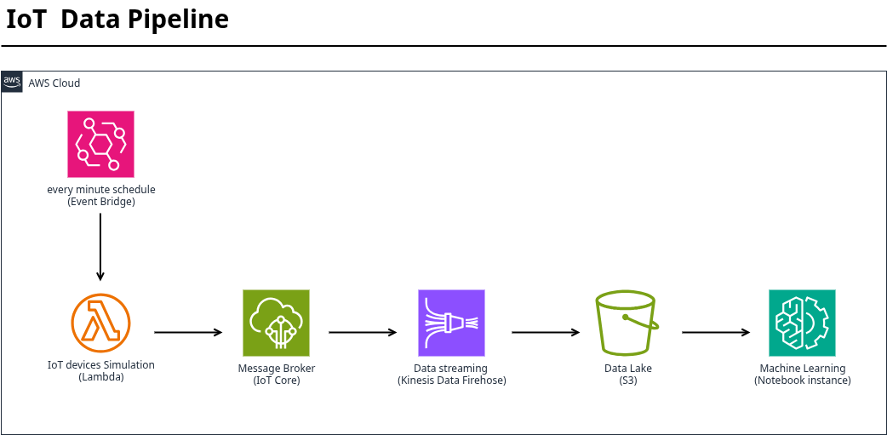

# IoT Data Pipeline on AWS

## 1. Overview

This project implements a serverless, scalable IoT data pipeline on Amazon Web Services (AWS). The pipeline ingests simulated sensor data, processes it in real-time, and stores it in a data lake for analysis. The entire infrastructure is defined and deployed as code using Terraform, ensuring reproducibility and version control.

**Primary Goal:** To demonstrate a complete, automated flow of IoT data from a device simulator to an analytical environment, showcasing core AWS serverless services and Infrastructure as Code (IaC) best practices.

## 2. Architecture & Data Flow

The pipeline follows a unidirectional, event-driven architecture:

1.  **Data Generation:** A Python script running within an **AWS Lambda** function simulates an IoT device (e.g., a temperature sensor) by publishing JSON-formatted payloads.
2.  **Ingestion & Message Broker:** The simulated device publishes its data to **AWS IoT Core**, which acts as a secure message broker and entry point for IoT devices.
3.  **Data Delivery & Buffering:** A rule in IoT Core is configured to route all incoming messages to an **Amazon Kinesis Data Firehose** delivery stream.
4.  **Storage:** Kinesis Firehose reliably buffers, batches, and delivers the data to an **Amazon S3** bucket, creating a raw data lake.
5.  **Analysis:** A **SageMaker Jupyter Notebook Instance** is used to access the data in S3, perform data exploration, transformation, and analysis using Python libraries like Pandas and Matplotlib.

### Architectural Diagram

## 3. Component Details

### AWS Lambda (Device Simulator)
- **Runtime:** Python 3.11
- **Function:** Generates sample IoT telemetry data (e.g., `device_id`, `timestamp`, `temperature`, `humidity`).
- **Trigger:** Configured to run on a schedule (using EventBridge) to simulate data bursts.
- **Integration:** Uses the AWS IoT Data Plane SDK (boto3) to publish messages to a specific MQTT topic in IoT Core.

### AWS IoT Core
- **Role:** Secure and scalable MQTT message broker.
- **Configuration:**
    - A policy is attached to the Lambda function's identity, granting it permission to `iot:Publish`.
    - An **IoT Rule** is defined with a SQL `SELECT *` statement to capture all messages from the simulator's topic.
    - The rule action is configured to send the messages to the Kinesis Data Firehose delivery stream.

### Amazon Kinesis Data Firehose
- **Role:** Captures, batches, compresses, and delivers the streaming data to S3.
- **Configuration:**
    - Does not perform transformation (pass-through).
    - Buffers incoming data for a specified period (e.g., 60 seconds) or file size before delivering to S3.
    - Automatically adds a timestamp prefix to the S3 object path (e.g., `year=!{timestamp:YYYY}/month=!{timestamp:MM}/day=!{timestamp:dd}/`), creating a Hive-style partitioned structure for efficient querying.

### Amazon S3 (Simple Storage Service)
- **Role:** The durable, cost-effective data lake storage layer.
- **Structure:** Data is stored in a partitioned structure, organized by date (e.g., `s3://bucket-name/raw-data/year=2025/month=10/day=15/data_2025-10-15-12-00-00`).

### Amazon SageMaker (Jupyter Notebook instance)
- **Role:** Provides a managed machine learning environment for data analysis.
- **Configuration:** The notebook instance is launched with an IAM role that has read-only access to the S3 data bucket. Analysts can use Python to read the JSON files directly from S3 for analysis.

## 4. Infrastructure as Code (IaC) with Terraform

The project is fully deployed using Terraform, which manages the lifecycle of all AWS resources.

- **Root Module:** The main entry point containing resource definitions for S3, IAM roles, IoT Core, Kinesis Firehose, Lambda, and SageMaker.
- **Key Terraform Concepts Used:**
    - **Resources:** To define each AWS component (e.g., `aws_s3_bucket`, `aws_iot_topic_rule`).
    - **Data Sources:** To fetch information like the AWS caller identity for IAM policies.
    - **Outputs:** To print important values like the S3 bucket name and Jupyter notebook URL after deployment.

### Deployment Steps
1.  `terraform init` - Initialize the Terraform working directory.
2.  `terraform plan` - Review the execution plan.
3.  `terraform apply` - Create the infrastructure. Type `yes` to confirm.

To destroy all resources: `terraform destroy`.
